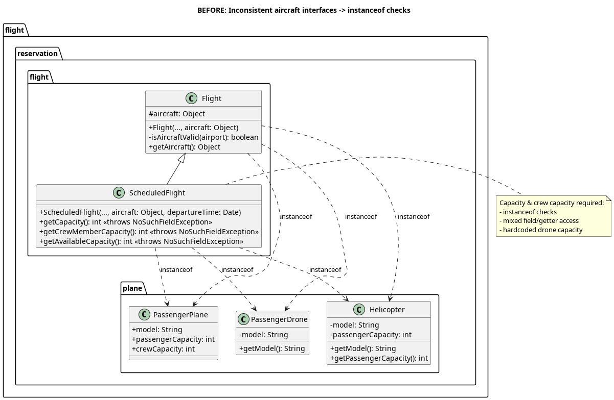

# Adapter Pattern (Aircraft Interface Unification)

## Table of Contents
1. [Application and Reasoning](#application-and-reasoning)
2. [Benefits and Drawbacks](#benefits-and-drawbacks)
3. [Class Diagrams (PlantUML)](#class-diagrams-plantuml)
4. [Code Changes (Snippets)](#code-changes-snippets)
5. [How to Use / Examples](#how-to-use--examples)
6. [Extending With a New Aircraft Type](#extending-with-a-new-aircraft-type)

---

## Application and Reasoning

### Problem in the codebase (before)
The reservation domain supports multiple aircraft classes, but they expose data differently:

- `PassengerPlane`: exposes `model`, `passengerCapacity`, `crewCapacity` as **public fields**
- `Helicopter`: exposes values via **getter methods**
- `PassengerDrone`: exposes only a `model` getter; capacity and crew capacity were effectively **special-cased/hardcoded** in client code

As a result, client code (notably `Flight` route validation and `ScheduledFlight` capacity logic) needed:
- repeated `instanceof` checks
- mixed access patterns (fields vs getters)
- hardcoded values for certain types
- defensive error handling (e.g., `NoSuchFieldException`) in higher layers

This created tight coupling between flight logic and concrete aircraft classes, and made adding a new aircraft type require edits in multiple places.

### Why Adapter Pattern
The Adapter Pattern fits because:
- The aircraft classes already exist and should remain unchanged (legacy domain classes).
- Their interfaces are incompatible from the perspective of flight logic.
- We want a single, stable interface for aircraft data so `Flight`/`ScheduledFlight` work polymorphically.
- We want to remove `instanceof` logic from business logic.

### How it is applied here
1. Introduce a **target interface**: `AircraftAdapter`
2. Implement an adapter per aircraft type:
   - `PassengerPlaneAdapter` wraps `PassengerPlane`
   - `HelicopterAdapter` wraps `Helicopter`
   - `PassengerDroneAdapter` wraps `PassengerDrone`
3. Change clients (`Flight`, `ScheduledFlight`, `Schedule`) to depend on `AircraftAdapter` instead of `Object`.
4. Replace conditional logic with delegation:
   - capacity = `aircraft.getPassengerCapacity()`
   - crew capacity = `aircraft.getCrewCapacity()`
   - model = `aircraft.getModel()`

---

## Benefits and Drawbacks

### Benefits
- **Uniform interface** for aircraft data (`model`, passenger capacity, crew capacity)
- **Eliminates scattered `instanceof` checks** in core logic (`Flight`, `ScheduledFlight`)
- **Encapsulates aircraft-specific quirks** inside adapters (e.g., drone capacity constants)
- **Open/Closed improvement**: new aircraft types typically only require a new adapter
- **Cleaner client code**: `Flight` and `ScheduledFlight` are simpler and more maintainable

### Drawbacks
- **More classes** (one adapter per aircraft type)
- **Indirection**: values are accessed through an adapter method call
- **Adapter maintenance**: if an aircraft class changes, its adapter may need updating

---

## Class Diagrams (PlantUML)

> Only the classes involved in the aircraft-access problem are shown (affected classes).

### BEFORE (no adapter; instanceof checks)


### AFTER (adapter introduced; polymorphic access)

---

## Code Changes (Snippets)

### 1) Target interface introduced (`AircraftAdapter`)
```java
public interface AircraftAdapter extends Aircraft {
    String getType();
}
```

### 2) Adapters translate each aircraft’s interface to `AircraftAdapter`

#### PassengerPlaneAdapter (adapts public fields)
```java
public class PassengerPlaneAdapter implements AircraftAdapter {
    private final PassengerPlane plane;

    @Override public String getModel() { return plane.model; }
    @Override public int getPassengerCapacity() { return plane.passengerCapacity; }
    @Override public int getCrewCapacity() { return plane.crewCapacity; }
    @Override public String getType() { return "PassengerPlane"; }
}
```

#### HelicopterAdapter (delegates to getters, provides crew policy)
```java
public class HelicopterAdapter implements AircraftAdapter {
    private final Helicopter helicopter;

    @Override public String getModel() { return helicopter.getModel(); }
    @Override public int getPassengerCapacity() { return helicopter.getPassengerCapacity(); }
    @Override public int getCrewCapacity() { return 1; } // adapter-owned rule
    @Override public String getType() { return "Helicopter"; }
}
```

#### PassengerDroneAdapter (encapsulates constants previously hardcoded outside)
```java
public class PassengerDroneAdapter implements AircraftAdapter {
    private static final int DRONE_PASSENGER_CAPACITY = 4;
    private static final int DRONE_CREW_CAPACITY = 0;

    @Override public String getModel() { return drone.getModel(); }
    @Override public int getPassengerCapacity() { return DRONE_PASSENGER_CAPACITY; }
    @Override public int getCrewCapacity() { return DRONE_CREW_CAPACITY; }
    @Override public String getType() { return "PassengerDrone"; }
}
```

### 3) Client update: `Flight` uses `AircraftAdapter` instead of `Object`
```java
public class Flight {
    protected AircraftAdapter aircraft;

    public Flight(int number, Airport departure, Airport arrival, AircraftAdapter aircraft) {
        // ...existing code...
    }

    private boolean isAircraftValid(Airport airport) {
        String model = aircraft.getModel();
        return Arrays.stream(airport.getAllowedAircrafts()).anyMatch(x -> x.equals(model));
    }
}
```

### 4) Client update: `ScheduledFlight` delegates capacity queries to adapter
```java
public class ScheduledFlight extends Flight {
    // ...existing code...
    public int getCapacity() { return aircraft.getPassengerCapacity(); }
    public int getCrewMemberCapacity() { return aircraft.getCrewCapacity(); }
}
```

### 5) Integration: `Schedule` passes adapters through to ScheduledFlight
```java
public void scheduleFlight(Flight flight, Date date) {
    ScheduledFlight scheduledFlight = new ScheduledFlight(
        flight.getNumber(),
        flight.getDeparture(),
        flight.getArrival(),
        flight.getAircraft(),
        date
    );
    scheduledFlights.add(scheduledFlight);
}
```

---

## How to Use / Examples

### Creating flights with different aircraft types (uniform usage)
```java
AircraftAdapter a380 = new PassengerPlaneAdapter(new PassengerPlane("A380"));
AircraftAdapter h1 = new HelicopterAdapter(new Helicopter("H1"));
AircraftAdapter drone = new PassengerDroneAdapter(new PassengerDrone("HypaHype"));

Flight f1 = new Flight(1, dep, arr, a380);
Flight f2 = new Flight(2, dep, arr, h1);
Flight f3 = new Flight(3, dep, arr, drone);
```

### Capacity access is now uniform
```java
ScheduledFlight sf = schedule.searchScheduledFlight(1);
int cap = sf.getCapacity();
int crew = sf.getCrewMemberCapacity();
```

---

## Extending With a New Aircraft Type

To add a new aircraft class `NewAircraft` without touching `Flight`/`ScheduledFlight`:
1. Implement `NewAircraft` (or use an existing class).
2. Create `NewAircraftAdapter implements AircraftAdapter`.
3. Use the new adapter wherever flights are created.

```java
public class NewAircraftAdapter implements AircraftAdapter {
    private final NewAircraft aircraft;
    // implement getModel/getPassengerCapacity/getCrewCapacity/getType
}
```
